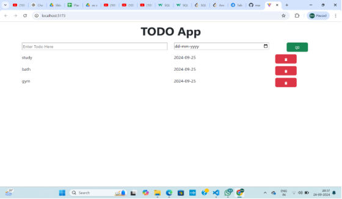

**Todo Application**

This Todo Application is designed to help users efficiently manage their daily tasks. It allows users to add, edit, delete, and view tasks scheduled for the day, making task management simple and intuitive.

**Features:**

- **Add Tasks**: Easily add new tasks to your daily schedule.
- **Edit Tasks**: Modify existing tasks with updated information.
- **Delete Tasks**: Remove completed or unnecessary tasks from the list.
- **View Tasks**: Display a clear list of all scheduled tasks for the day.

**Technologies Used:**

- **React**: Utilizes various React hooks for state management and component functionality.
- **Bootstrap**: Ensures responsiveness and a mobile-friendly interface.
- **React Icon Library**: Provides a wide range of icons to enhance the user interface.

This project is a great starting point for mastering React, managing state with hooks, and implementing responsive design using Bootstrap.

